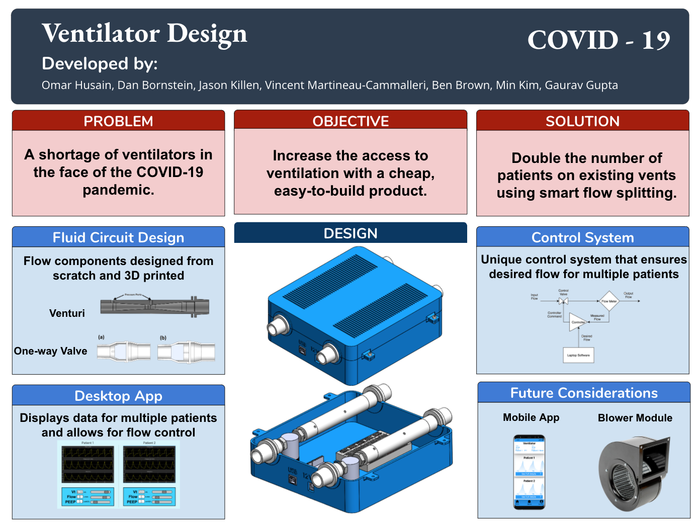

# Smart Ventilator Splitter Design

<!--  -->

## Concept
Goal: To DOUBLE the number of patients that have access to a ventilator by splitting up the flow from a ventilator into two individual patient circuits.

Problem: Different patients have different lung resistances and compliances that affect the flow rate in each of the split flow passages.

Solution: Use a controller and control valve to ensure adequate flow rate in each patient circuit.

## Main Components
This project is open source and we welcome you to look at the different features and improve upon them. The main features of this project are the following:
- desktop app
- arduino controller
- electrical schematic
- mechanical components and design