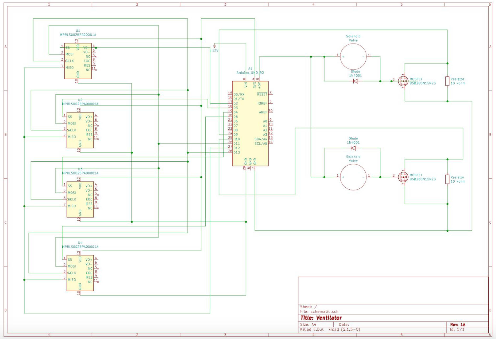

# Smart Splitter Electronics

The electrical system consists of an arduino uno microcontroller that controls solenoid control valves based on the sensor readings from four pressure sensors. The power input for this system is a 12V wall adapter.

## Components

- Arduino uno
- USB Cable A to B
- Compact Solenoid Flow-Adjustment Valve: McMaster-Carr: PN 2555N12 (2x)
- Micropressure eval board 0-25 PSI: Honeywell: PN MPRLS0025PA00001AB (4x)
- 12V DC Wall Adapter
- Diode Rectifier: 1A 50V (2x)
- N-Channel MOSFET: 60V 30A (2x)
- 10 kOhm Resister (2x)
- Breadboard
- Jumper wires (F/M, M/M, F/F)

## Future Considerations

- The micropressure sensors from Honeywell are not ideal for an Arduino Uno since they use 3.3V logic and the Uno is a 5V machine.
    - SPI protocol was also confusing to implement for these sensors because of the way the datasheet is organized.
    - Look for 5V pressure sensors with a suitable pressure range and SPI protocol.
- Power Input
    - Use a chargeable battery along with a 12V wall adapter to create a portable system.
- Use an integrated circuit for the solenoid valves instead of the MOSFET, diode, resistor set up for better control of the valves.