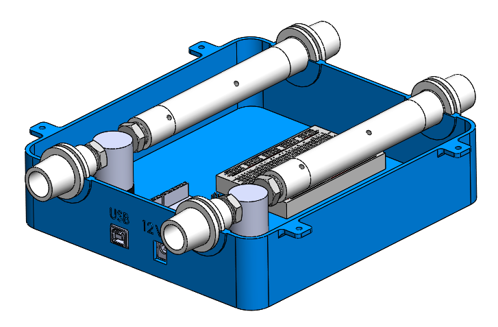
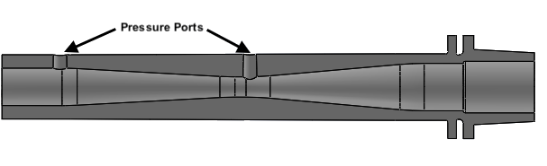
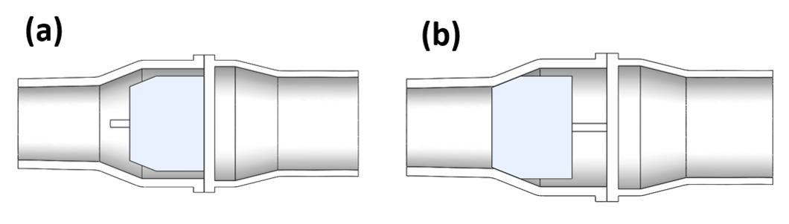

# Mechanical Design of Ventilator Splitter

# Fluid Circuit

The system depends on being able to control the flow rate through each patient circuit. In order to control the flow rate, the system needs to provide accurate measurements of the flow rate. To do this, we designed a venturi tube, which allowed us to calculate the flow rate by measuring the pressure at two different points in the tube.

We also designed one-way check valves to prevent expiratory flow from flowing back to the inspiratory circuit.

These parts along with some fittings for the solenoid valves were 3d printed.